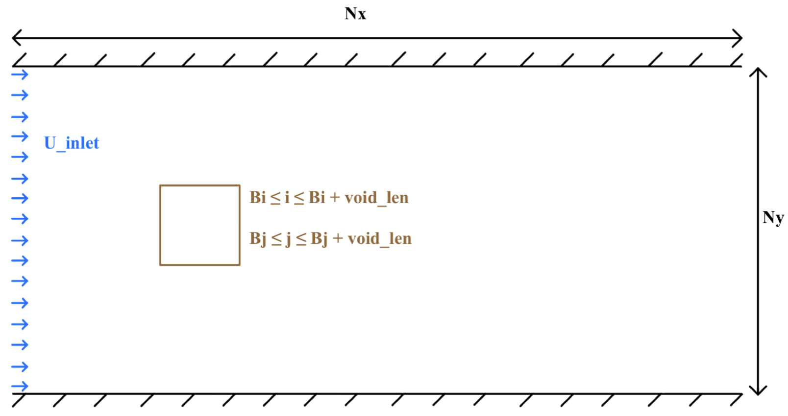
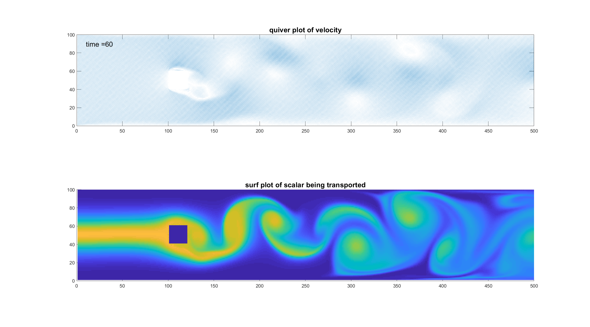

# 2D_NavierStokesSolver_ScalarTransport

Objective of the project: create a second-order unsteady Navier-Stokes solver on a semi-complex geometry including scalar transport. Pictured below is an image of the geometry. The domain consists of a Nx by Ny grid of cells with the brown box pictured below being a void consisting of four walls that fluid cannot flow through. The velocity flowing in on the left hand side of the domain has a magnitude of U_inlet and is perfectly parallel to the upper and lower walls. The right hand side of the domain is open so fluid can flow out. In addition to calculating the fluids velocity over time, a scalar (think dye) is transported throughout the flow. 

The steps of the solver are described in the HW7_MAE6230_2020 pdf's, one which is the original document from my computational fluid dynamics course at Cornell and the other which is the same version with my notes written all over it. 

The equations that are "solved" in this flow solver are the 2D incompressible Navier-Stokes equations and the scalar transport equation (equation 6 in HW7_MAE6230_2020_orig.pdf) with an inital profile on the left hand side of the domain described by equation 7 in HW7_MAE6230_2020_orig.pdf.

Some things that can be changed about the problem we are solving without having to significantly change the code: 
1. Bi and Bj: x and y location of the bottom left corner of the void.  
2. void_len: length of the void. For now, the code only deals with square voids and the code would have to be moderately modified in order to deal with a rectangular void. 
3. U_inlet: velocity of the inlet flow. 
4. Re: Reynolds number of the fluid. This is a dimensionless quantity that is used to identify whether a fluid will tend towards a calmer or a more turbulent flow. Higher Reynolds number generally corresponds to a more turbulent flow while a lower Reynolds number generally corresponds to a calmer, more laminar flow. 
5. Nx and Ny: number of cells in the x and y direction of the domain. Increasing these numbers leads to better resolution but increases computation time. 

Some notes:
1. A Gauss-Seidel solver is used to solve for the pressure but this is higly inefficient. For a faster running code, one might want to swap this out for a faster pressure solver, i.e. a conjugate gradient solver or a multigrid method. 
2. Three methods were implemented for solving the the scalar transport equations: first order upwinding, second order central differencing, and third order QUICK. The second order method was blowing up once the vortices reached the right hand side of the domain so there is likely an error. QUICK has the best accuracy and doesn't add much computation time so I would suggest just using QUICK.

# Results

I've made two videos that show the velocity and scalar transport over time in the video called "Video_highres_quick_Re400.avi" for a run that used quick for the scalar transnprot equation and a Reynolds number of 400. Here is a teaser of thie video!

